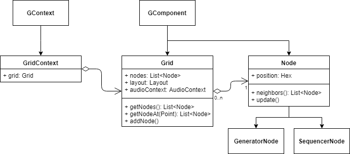
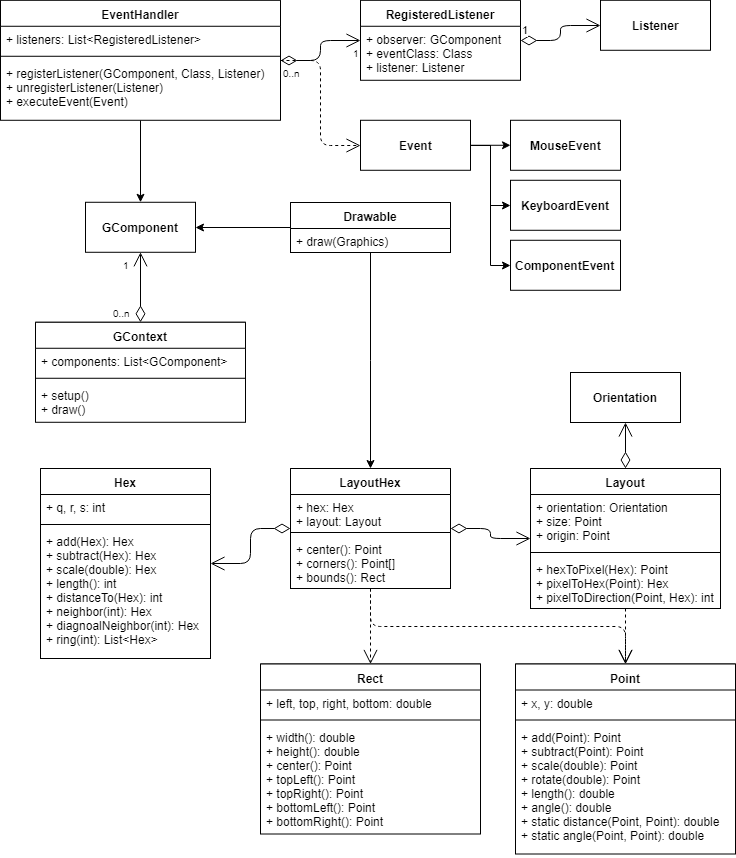
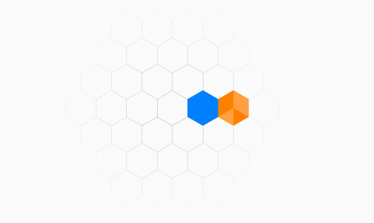

# CSD2d induvidual Project #

This is the documentation for the CSD2d induvidual project.

## Context ##
**Life** is a composition environment that can be used for algorithmic composition. The interface is based on a hexagonal grid on which objects can be placed.

Life is made for composers to quickly generate material or to compose based on this material. The components of Life (called *nodes*) can be extended or new ones can be built to enhance the composition process.

## Functionality ##

### Minimal viable product ###
* A framework consisting of a **grid** of hexagons on which **nodes** can be placed.
* A set of predefined nodes.

### Possible extensions ###
Things that have priority:
* Loading and saving projects.
* More nodes, such as filters, random generators, fetchers of online data...

Things that would be nice:
* An easy to use library to create new nodes and extend the functionality of Grid.
* More nodes.

### Modular design ###
Life is designed with a modular mindset. It is currently built on top of [Processing](https://processing.org/) and
[Beads](http://www.beadsproject.net/), but it is written in a way that it takes minimal effort to use another graphical
or audio backend.

Current modules are:
* **life**: contains the `Grid` and `Node` classes.
* **life.nodes**: contains subclasses of `Node`.

* **life.gui**: contains classes that create an abstraction layer for a graphical user interface.

### User interface ###
The user interface consists of a hexagonal grid on which hexagonal nodes can be placed. In the bottom of the window
is a bar that contains the nodes that can be placed. When such node is selected, the mouse click places a node of
that type.

---

## Planning ##
**April 30 - May 6**
* Finishing project documentation
* Deciding on language and libraries to use which are ideally cross-platform

**May 7 - 13**
* Framework:
  * Model
  * Start with UI: displaying and interacting with the model
  * Start with audio engine

**May 14 - 20**
* Start with nodes:
  * Display
  * Audio output
* Start with UI framework for units

**May 21 - 27**
* Add more nodes
* Node components:
  * Interaction (UI)

**May 28 - June 3**
* Polishing

**June 4 - 10**
* Finishing and polishing

**June 11**
* Presentation
