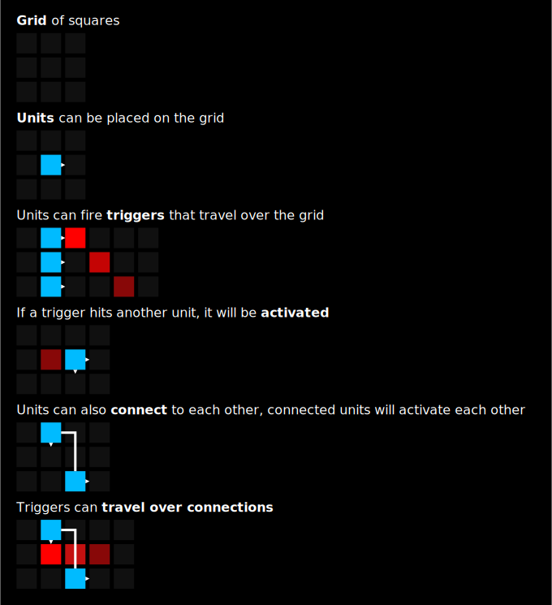

- Project omschrijving:
  - De functionaliteiten (Wat kan het? Hoe gebruik je het?) adhv:
    - UI-ontwerp + toelichting
    - audio signal flow diagram + toelichting
- Minimal viable product
- Data flow diagram (inclusief UI)
- Class diagram
- Planning

# CSD2d induvidual Project #

This is the documentation for the CSD2d induvidual project.

## Context ##
**Grid** (working name) is a composition environment that can be used for algorithmic composition. The interface is based on a square grid on which objects can be placed.

Grid is made for composers to quickly generate material or to compose based on this material. The componentsof Grid (called *units*) can be extended or new ones can be built to enhance the composition process.

## Funcionality ##

## Minimal viable product ##
* A framework consisting of a **grid** of squares on which **units** can be placed. These units can fire **triggers** and can be triggered when they are touched by a trigger. Units can also be connected to other units, causing them to trigger each other immediately.
* A set of units
* An easy to use library to create new units and extend the functionality of Grid.

### Components ###
* **Model**: contains the patch with nodes, channels and edges
* **Serializer**: serializes and deserializes the model to a saveable file format
* **View and controller**: displays and interacts with the model
* **Playback engine**: plays the sound

---

## Planning ##
**April 30 - May 6**
* Finishing project documentation
* Deciding on language and libraries to use which are ideally cross-platform

**May 7 - 13**
* Framework:
  * Model
  * Start with UI: displaying and interacting with the model
  * Start with audio engine

**May 14 - 20**
* Add possibility to save and load models from disk
* Start with unit components:
  * Display
  * Audio output
* Start with UI framework for units

**May 21 - 27**
* Add more units
* Unit components:
  * Interaction (UI)

**May 28 - June 3**
* Polishing

**June 4 - 10**
* Finishing and polishing

**June 11**
* Presentation
